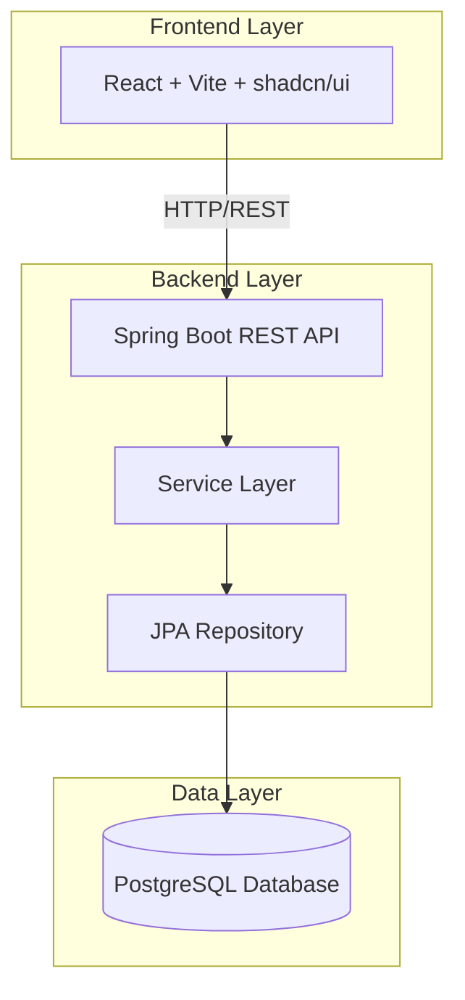
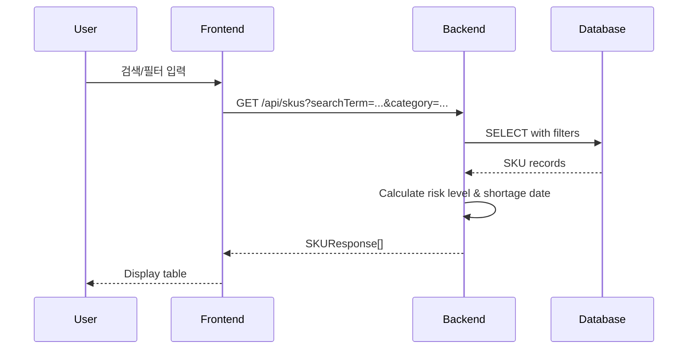

# 설계 문서: 재고(SKU) 관리 시스템

## 개요

재고(SKU) 관리 시스템은 3-tier 아키텍처를 기반으로 한 웹 애플리케이션입니다. React 기반 프론트엔드, Spring Boot 기반 RESTful API 백엔드, PostgreSQL 데이터베이스로 구성됩니다. 시스템은 SKU 데이터의 CRUD 작업, 검색/필터링, 정렬, 그리고 품절 위험 및 예상 품절일 자동 계산 기능을 제공합니다.

## 아키텍처

### 시스템 구성도



### 기술 스택

- **Frontend**: React 18, Vite, TypeScript, shadcn/ui, TanStack Query
- **Backend**: Spring Boot 3.x, Java 17+, Spring Data JPA, Spring Web
- **Database**: PostgreSQL 15+ (Docker)
- **API**: RESTful API, JSON
- **Build Tools**: Maven (Backend), npm/pnpm (Frontend)

## 컴포넌트 및 인터페이스

### 백엔드 컴포넌트

#### 1. Entity Layer

**SKU Entity**
```java
@Entity
@Table(name = "skus")
public class SKU {
    @Id
    @GeneratedValue(strategy = GenerationType.IDENTITY)
    private Long id;
    
    @Column(unique = true, nullable = false)
    private String skuCode;
    
    @Column(nullable = false)
    private String productName;
    
    @Column(nullable = false)
    private String category;
    
    @Column(nullable = false)
    private Integer currentStock;
    
    @Column(nullable = false)
    private Integer safeStock;
    
    @Column(nullable = false)
    private Double dailyConsumptionRate; // 일일 평균 소비량
    
    @Column
    private LocalDateTime createdAt;
    
    @Column
    private LocalDateTime updatedAt;
    
    // Getters, Setters, Constructors
}
```

#### 2. DTO Layer

**SKURequest DTO**
```java
public class SKURequest {
    @NotBlank
    private String skuCode;
    
    @NotBlank
    private String productName;
    
    @NotBlank
    private String category;
    
    @NotNull
    @Min(0)
    private Integer currentStock;
    
    @NotNull
    @Min(0)
    private Integer safeStock;
    
    @NotNull
    @Min(0)
    private Double dailyConsumptionRate;
}
```

**SKUResponse DTO**
```java
public class SKUResponse {
    private Long id;
    private String skuCode;
    private String productName;
    private String category;
    private Integer currentStock;
    private Integer safeStock;
    private String riskLevel; // "높음", "중간", "낮음"
    private LocalDate expectedShortageDate; // 예상 품절일
    private LocalDateTime createdAt;
    private LocalDateTime updatedAt;
}
```

#### 3. Repository Layer

**SKURepository Interface**
```java
@Repository
public interface SKURepository extends JpaRepository<SKU, Long> {
    Optional<SKU> findBySkuCode(String skuCode);
    
    boolean existsBySkuCode(String skuCode);
    
    @Query("SELECT s FROM SKU s WHERE " +
           "(:searchTerm IS NULL OR LOWER(s.skuCode) LIKE LOWER(CONCAT('%', :searchTerm, '%')) " +
           "OR LOWER(s.productName) LIKE LOWER(CONCAT('%', :searchTerm, '%'))) " +
           "AND (:category IS NULL OR s.category = :category) " +
           "AND (:problemStockOnly = false OR s.currentStock <= s.safeStock)")
    Page<SKU> findWithFilters(
        @Param("searchTerm") String searchTerm,
        @Param("category") String category,
        @Param("problemStockOnly") Boolean problemStockOnly,
        Pageable pageable
    );
}
```

#### 4. Service Layer

**SKUService Interface**
```java
public interface SKUService {
    SKUResponse createSKU(SKURequest request);
    SKUResponse getSKUById(Long id);
    Page<SKUResponse> getAllSKUs(String searchTerm, String category, 
                                  Boolean problemStockOnly, Pageable pageable);
    SKUResponse updateSKU(Long id, SKURequest request);
    void deleteSKU(Long id);
    
    // 계산 메서드
    String calculateRiskLevel(Integer currentStock, Integer safeStock);
    LocalDate calculateExpectedShortageDate(Integer currentStock, Integer safeStock, 
                                           Double dailyConsumptionRate);
}
```

**SKUServiceImpl**
```java
@Service
@Transactional
public class SKUServiceImpl implements SKUService {
    
    private final SKURepository skuRepository;
    
    @Override
    public SKUResponse createSKU(SKURequest request) {
        // 중복 체크
        if (skuRepository.existsBySkuCode(request.getSkuCode())) {
            throw new DuplicateSKUException("SKU 코드가 이미 존재합니다: " + request.getSkuCode());
        }
        
        SKU sku = mapToEntity(request);
        sku.setCreatedAt(LocalDateTime.now());
        sku.setUpdatedAt(LocalDateTime.now());
        
        SKU savedSKU = skuRepository.save(sku);
        return mapToResponse(savedSKU);
    }
    
    @Override
    public SKUResponse updateSKU(Long id, SKURequest request) {
        SKU sku = skuRepository.findById(id)
            .orElseThrow(() -> new SKUNotFoundException("SKU를 찾을 수 없습니다: " + id));
        
        // SKU 코드 변경 시 중복 체크
        if (!sku.getSkuCode().equals(request.getSkuCode()) && 
            skuRepository.existsBySkuCode(request.getSkuCode())) {
            throw new DuplicateSKUException("SKU 코드가 이미 존재합니다: " + request.getSkuCode());
        }
        
        updateEntityFromRequest(sku, request);
        sku.setUpdatedAt(LocalDateTime.now());
        
        SKU updatedSKU = skuRepository.save(sku);
        return mapToResponse(updatedSKU);
    }
    
    @Override
    public String calculateRiskLevel(Integer currentStock, Integer safeStock) {
        if (safeStock == 0) {
            return "낮음";
        }
        
        double ratio = (double) currentStock / safeStock;
        
        if (ratio < 0.5) {
            return "높음";
        } else if (ratio < 1.0) {
            return "중간";
        } else {
            return "낮음";
        }
    }
    
    @Override
    public LocalDate calculateExpectedShortageDate(Integer currentStock, Integer safeStock, 
                                                   Double dailyConsumptionRate) {
        if (currentStock <= safeStock) {
            return LocalDate.now(); // 즉시
        }
        
        if (dailyConsumptionRate <= 0) {
            return null; // 소비가 없으면 품절 없음
        }
        
        // 간단한 선형 계산: (현재재고 - 안전재고) / 일일소비량
        int daysUntilShortage = (int) Math.ceil((currentStock - safeStock) / dailyConsumptionRate);
        return LocalDate.now().plusDays(daysUntilShortage);
    }
    
    private SKUResponse mapToResponse(SKU sku) {
        SKUResponse response = new SKUResponse();
        response.setId(sku.getId());
        response.setSkuCode(sku.getSkuCode());
        response.setProductName(sku.getProductName());
        response.setCategory(sku.getCategory());
        response.setCurrentStock(sku.getCurrentStock());
        response.setSafeStock(sku.getSafeStock());
        response.setCreatedAt(sku.getCreatedAt());
        response.setUpdatedAt(sku.getUpdatedAt());
        
        // 계산된 필드
        response.setRiskLevel(calculateRiskLevel(sku.getCurrentStock(), sku.getSafeStock()));
        response.setExpectedShortageDate(calculateExpectedShortageDate(
            sku.getCurrentStock(), sku.getSafeStock(), sku.getDailyConsumptionRate()));
        
        return response;
    }
}
```

#### 5. Controller Layer

**SKUController**
```java
@RestController
@RequestMapping("/api/skus")
@CrossOrigin(origins = "http://localhost:5173") // Vite 기본 포트
public class SKUController {
    
    private final SKUService skuService;
    
    @PostMapping
    public ResponseEntity<SKUResponse> createSKU(@Valid @RequestBody SKURequest request) {
        SKUResponse response = skuService.createSKU(request);
        return ResponseEntity.status(HttpStatus.CREATED).body(response);
    }
    
    @GetMapping("/{id}")
    public ResponseEntity<SKUResponse> getSKU(@PathVariable Long id) {
        SKUResponse response = skuService.getSKUById(id);
        return ResponseEntity.ok(response);
    }
    
    @GetMapping
    public ResponseEntity<Page<SKUResponse>> getAllSKUs(
        @RequestParam(required = false) String searchTerm,
        @RequestParam(required = false) String category,
        @RequestParam(required = false, defaultValue = "false") Boolean problemStockOnly,
        @RequestParam(defaultValue = "0") int page,
        @RequestParam(defaultValue = "10") int size,
        @RequestParam(defaultValue = "id") String sortBy,
        @RequestParam(defaultValue = "ASC") String sortDirection
    ) {
        Sort.Direction direction = Sort.Direction.fromString(sortDirection);
        Pageable pageable = PageRequest.of(page, size, Sort.by(direction, sortBy));
        
        Page<SKUResponse> response = skuService.getAllSKUs(
            searchTerm, category, problemStockOnly, pageable);
        return ResponseEntity.ok(response);
    }
    
    @PutMapping("/{id}")
    public ResponseEntity<SKUResponse> updateSKU(
        @PathVariable Long id,
        @Valid @RequestBody SKURequest request
    ) {
        SKUResponse response = skuService.updateSKU(id, request);
        return ResponseEntity.ok(response);
    }
    
    @DeleteMapping("/{id}")
    public ResponseEntity<Void> deleteSKU(@PathVariable Long id) {
        skuService.deleteSKU(id);
        return ResponseEntity.noContent().build();
    }
}
```

### 프론트엔드 컴포넌트

#### 1. API Client

**skuApi.ts**
```typescript
import axios from 'axios';

const API_BASE_URL = 'http://localhost:8080/api';

export interface SKURequest {
  skuCode: string;
  productName: string;
  category: string;
  currentStock: number;
  safeStock: number;
  dailyConsumptionRate: number;
}

export interface SKUResponse {
  id: number;
  skuCode: string;
  productName: string;
  category: string;
  currentStock: number;
  safeStock: number;
  riskLevel: string;
  expectedShortageDate: string | null;
  createdAt: string;
  updatedAt: string;
}

export interface PageResponse<T> {
  content: T[];
  totalElements: number;
  totalPages: number;
  size: number;
  number: number;
}

export const skuApi = {
  getAll: (params: {
    searchTerm?: string;
    category?: string;
    problemStockOnly?: boolean;
    page?: number;
    size?: number;
    sortBy?: string;
    sortDirection?: 'ASC' | 'DESC';
  }) => axios.get<PageResponse<SKUResponse>>(`${API_BASE_URL}/skus`, { params }),
  
  getById: (id: number) => 
    axios.get<SKUResponse>(`${API_BASE_URL}/skus/${id}`),
  
  create: (data: SKURequest) => 
    axios.post<SKUResponse>(`${API_BASE_URL}/skus`, data),
  
  update: (id: number, data: SKURequest) => 
    axios.put<SKUResponse>(`${API_BASE_URL}/skus/${id}`, data),
  
  delete: (id: number) => 
    axios.delete(`${API_BASE_URL}/skus/${id}`),
};
```

#### 2. React Components

**SKUTable.tsx**
```typescript
import { useState } from 'react';
import { useQuery } from '@tanstack/react-query';
import { skuApi, SKUResponse } from '@/api/skuApi';
import {
  Table,
  TableBody,
  TableCell,
  TableHead,
  TableHeader,
  TableRow,
} from '@/components/ui/table';
import { Button } from '@/components/ui/button';
import { ArrowUpDown } from 'lucide-react';

interface SKUTableProps {
  searchTerm: string;
  category: string;
  problemStockOnly: boolean;
}

export function SKUTable({ searchTerm, category, problemStockOnly }: SKUTableProps) {
  const [sortBy, setSortBy] = useState('id');
  const [sortDirection, setSortDirection] = useState<'ASC' | 'DESC'>('ASC');
  const [page, setPage] = useState(0);
  
  const { data, isLoading, error } = useQuery({
    queryKey: ['skus', searchTerm, category, problemStockOnly, page, sortBy, sortDirection],
    queryFn: () => skuApi.getAll({
      searchTerm,
      category,
      problemStockOnly,
      page,
      size: 10,
      sortBy,
      sortDirection,
    }).then(res => res.data),
  });
  
  const handleSort = (column: string) => {
    if (sortBy === column) {
      setSortDirection(sortDirection === 'ASC' ? 'DESC' : 'ASC');
    } else {
      setSortBy(column);
      setSortDirection('ASC');
    }
  };
  
  const getRiskLevelColor = (riskLevel: string) => {
    switch (riskLevel) {
      case '높음': return 'text-red-600 font-semibold';
      case '중간': return 'text-yellow-600 font-semibold';
      case '낮음': return 'text-green-600';
      default: return '';
    }
  };
  
  if (isLoading) return <div>로딩 중...</div>;
  if (error) return <div>오류가 발생했습니다</div>;
  if (!data || data.content.length === 0) return <div>No data</div>;
  
  return (
    <div>
      <Table>
        <TableHeader>
          <TableRow>
            <TableHead>SKU 코드</TableHead>
            <TableHead>
              <Button variant="ghost" onClick={() => handleSort('productName')}>
                제품명 <ArrowUpDown className="ml-2 h-4 w-4" />
              </Button>
            </TableHead>
            <TableHead>카테고리</TableHead>
            <TableHead>현재 재고</TableHead>
            <TableHead>안전 재고</TableHead>
            <TableHead>품절 위험</TableHead>
            <TableHead>
              <Button variant="ghost" onClick={() => handleSort('expectedShortageDate')}>
                예상 품절일 <ArrowUpDown className="ml-2 h-4 w-4" />
              </Button>
            </TableHead>
            <TableHead>작업</TableHead>
          </TableRow>
        </TableHeader>
        <TableBody>
          {data.content.map((sku: SKUResponse) => (
            <TableRow key={sku.id}>
              <TableCell>{sku.skuCode}</TableCell>
              <TableCell>{sku.productName}</TableCell>
              <TableCell>{sku.category}</TableCell>
              <TableCell>{sku.currentStock}</TableCell>
              <TableCell>{sku.safeStock}</TableCell>
              <TableCell className={getRiskLevelColor(sku.riskLevel)}>
                {sku.riskLevel}
              </TableCell>
              <TableCell>
                {sku.expectedShortageDate || '-'}
              </TableCell>
              <TableCell>
                <Button variant="outline" size="sm">수정</Button>
                <Button variant="destructive" size="sm" className="ml-2">삭제</Button>
              </TableCell>
            </TableRow>
          ))}
        </TableBody>
      </Table>
      
      {/* Pagination */}
      <div className="flex justify-between items-center mt-4">
        <Button 
          onClick={() => setPage(p => Math.max(0, p - 1))}
          disabled={page === 0}
        >
          이전
        </Button>
        <span>페이지 {page + 1} / {data.totalPages}</span>
        <Button 
          onClick={() => setPage(p => p + 1)}
          disabled={page >= data.totalPages - 1}
        >
          다음
        </Button>
      </div>
    </div>
  );
}
```

**SearchFilters.tsx**
```typescript
import { useState } from 'react';
import { Input } from '@/components/ui/input';
import { Button } from '@/components/ui/button';
import { Checkbox } from '@/components/ui/checkbox';
import {
  Select,
  SelectContent,
  SelectItem,
  SelectTrigger,
  SelectValue,
} from '@/components/ui/select';

interface SearchFiltersProps {
  onSearch: (filters: {
    searchTerm: string;
    category: string;
    problemStockOnly: boolean;
  }) => void;
}

export function SearchFilters({ onSearch }: SearchFiltersProps) {
  const [searchTerm, setSearchTerm] = useState('');
  const [category, setCategory] = useState('');
  const [problemStockOnly, setProblemStockOnly] = useState(false);
  
  const handleSearch = () => {
    onSearch({ searchTerm, category, problemStockOnly });
  };
  
  return (
    <div className="flex gap-4 mb-6">
      <Input
        placeholder="검색 (SKU/제품명)"
        value={searchTerm}
        onChange={(e) => setSearchTerm(e.target.value)}
        className="flex-1"
      />
      
      <Select value={category} onValueChange={setCategory}>
        <SelectTrigger className="w-[200px]">
          <SelectValue placeholder="카테고리" />
        </SelectTrigger>
        <SelectContent>
          <SelectItem value="">전체</SelectItem>
          <SelectItem value="전자제품">전자제품</SelectItem>
          <SelectItem value="식품">식품</SelectItem>
          <SelectItem value="의류">의류</SelectItem>
        </SelectContent>
      </Select>
      
      <div className="flex items-center gap-2">
        <Checkbox
          id="problemStock"
          checked={problemStockOnly}
          onCheckedChange={(checked) => setProblemStockOnly(checked as boolean)}
        />
        <label htmlFor="problemStock" className="text-sm">
          🔥 문제 재고 중점만 보기
        </label>
      </div>
      
      <Button onClick={handleSearch}>검색</Button>
    </div>
  );
}
```

## 데이터 모델

### 데이터베이스 스키마

```sql
CREATE TABLE skus (
    id BIGSERIAL PRIMARY KEY,
    sku_code VARCHAR(100) UNIQUE NOT NULL,
    product_name VARCHAR(255) NOT NULL,
    category VARCHAR(100) NOT NULL,
    current_stock INTEGER NOT NULL CHECK (current_stock >= 0),
    safe_stock INTEGER NOT NULL CHECK (safe_stock >= 0),
    daily_consumption_rate DOUBLE PRECISION NOT NULL CHECK (daily_consumption_rate >= 0),
    created_at TIMESTAMP NOT NULL DEFAULT CURRENT_TIMESTAMP,
    updated_at TIMESTAMP NOT NULL DEFAULT CURRENT_TIMESTAMP
);

CREATE INDEX idx_sku_code ON skus(sku_code);
CREATE INDEX idx_category ON skus(category);
CREATE INDEX idx_current_stock ON skus(current_stock);
```

### 데이터 흐름




## Correctness Properties

속성(Property)은 시스템의 모든 유효한 실행에서 참이어야 하는 특성 또는 동작입니다. 본질적으로 시스템이 무엇을 해야 하는지에 대한 형식적 진술입니다. 속성은 사람이 읽을 수 있는 명세와 기계가 검증할 수 있는 정확성 보장 사이의 다리 역할을 합니다.

### Property 1: SKU 생성 라운드트립

*모든* 유효한 SKU 요청에 대해, SKU를 생성한 후 해당 ID로 조회하면 동일한 데이터(ID 제외)를 반환해야 한다.

**Validates: Requirements 1.1, 1.4, 2.3**

### Property 2: 필수 필드 검증

*모든* SKU 생성 요청에 대해, 필수 필드(SKU 코드, 제품명, 카테고리, 현재 재고, 안전 재고) 중 하나라도 누락되면 요청이 거부되어야 한다.

**Validates: Requirements 1.2**

### Property 3: 응답 완전성

*모든* SKU 조회 응답에 대해, SKU 코드, 제품명, 카테고리, 현재 재고, 안전 재고, 품절 위험, 예상 품절일 필드가 모두 포함되어야 한다.

**Validates: Requirements 2.2**

### Property 4: SKU 목록 조회 완전성

*모든* SKU 목록 조회에 대해, 데이터베이스에 저장된 모든 SKU가 결과에 포함되어야 한다(필터가 적용되지 않은 경우).

**Validates: Requirements 2.1**

### Property 5: SKU 업데이트 라운드트립

*모든* 유효한 SKU 업데이트 요청에 대해, SKU를 업데이트한 후 조회하면 업데이트된 데이터가 반환되어야 한다.

**Validates: Requirements 3.1, 3.4**

### Property 6: SKU 삭제 효과

*모든* 유효한 SKU ID에 대해, SKU를 삭제한 후 해당 ID로 조회하면 404 오류가 반환되어야 한다.

**Validates: Requirements 4.1, 4.3**

### Property 7: 검색 필터 정확성

*모든* 검색어에 대해, 검색 결과의 모든 SKU는 SKU 코드 또는 제품명에 검색어를 포함해야 한다(대소문자 무시).

**Validates: Requirements 5.1**

### Property 8: 카테고리 필터 정확성

*모든* 카테고리 필터에 대해, 필터링된 결과의 모든 SKU는 선택된 카테고리에 속해야 한다.

**Validates: Requirements 5.2**

### Property 9: 문제 재고 필터 정확성

*모든* SKU 목록에 대해, "문제 재고 중점만 보기" 필터가 활성화되면 결과의 모든 SKU는 현재 재고가 안전 재고 이하이거나 품절 위험이 "높음" 또는 "중간"이어야 한다.

**Validates: Requirements 5.3**

### Property 10: 복합 필터 정확성

*모든* 필터 조합(검색어, 카테고리, 문제 재고)에 대해, 결과의 모든 SKU는 적용된 모든 필터 조건을 만족해야 한다.

**Validates: Requirements 5.4**

### Property 11: 정렬 정확성

*모든* 정렬 요청(제품명 또는 예상 품절일)에 대해, 결과는 지정된 컬럼과 방향(오름차순/내림차순)에 따라 올바르게 정렬되어야 한다.

**Validates: Requirements 6.1, 6.2, 6.3**

### Property 12: 품절 위험 계산 정확성

*모든* SKU에 대해, 품절 위험은 다음 규칙에 따라 계산되어야 한다:
- 현재 재고 < 안전 재고 × 0.5 → "높음"
- 안전 재고 × 0.5 ≤ 현재 재고 < 안전 재고 → "중간"
- 현재 재고 ≥ 안전 재고 → "낮음"

**Validates: Requirements 7.1, 7.2, 7.3, 7.4**

### Property 13: 예상 품절일 계산 정확성

*모든* SKU에 대해, 예상 품절일은 다음 규칙에 따라 계산되어야 한다:
- 현재 재고 ≤ 안전 재고 → 현재 날짜
- 현재 재고 > 안전 재고 → 현재 날짜 + ⌈(현재 재고 - 안전 재고) / 일일 소비량⌉일

**Validates: Requirements 8.1, 8.2, 8.3**

### Property 14: 에러 상태 코드 정확성

*모든* API 에러 상황에 대해, 적절한 HTTP 상태 코드가 반환되어야 한다:
- 존재하지 않는 리소스 → 404
- 중복된 SKU 코드 → 409 또는 400
- 유효하지 않은 입력 → 400

**Validates: Requirements 10.4**

## 에러 처리

### 에러 응답 형식

모든 에러 응답은 다음 형식을 따릅니다:

```json
{
  "timestamp": "2024-01-15T10:30:00",
  "status": 404,
  "error": "Not Found",
  "message": "SKU를 찾을 수 없습니다: 123",
  "path": "/api/skus/123"
}
```

### 에러 처리 전략

**GlobalExceptionHandler**
```java
@RestControllerAdvice
public class GlobalExceptionHandler {
    
    @ExceptionHandler(SKUNotFoundException.class)
    public ResponseEntity<ErrorResponse> handleSKUNotFound(SKUNotFoundException ex) {
        ErrorResponse error = new ErrorResponse(
            LocalDateTime.now(),
            HttpStatus.NOT_FOUND.value(),
            "Not Found",
            ex.getMessage(),
            request.getRequestURI()
        );
        return ResponseEntity.status(HttpStatus.NOT_FOUND).body(error);
    }
    
    @ExceptionHandler(DuplicateSKUException.class)
    public ResponseEntity<ErrorResponse> handleDuplicateSKU(DuplicateSKUException ex) {
        ErrorResponse error = new ErrorResponse(
            LocalDateTime.now(),
            HttpStatus.CONFLICT.value(),
            "Conflict",
            ex.getMessage(),
            request.getRequestURI()
        );
        return ResponseEntity.status(HttpStatus.CONFLICT).body(error);
    }
    
    @ExceptionHandler(MethodArgumentNotValidException.class)
    public ResponseEntity<ErrorResponse> handleValidationErrors(MethodArgumentNotValidException ex) {
        String message = ex.getBindingResult().getFieldErrors().stream()
            .map(error -> error.getField() + ": " + error.getDefaultMessage())
            .collect(Collectors.joining(", "));
        
        ErrorResponse error = new ErrorResponse(
            LocalDateTime.now(),
            HttpStatus.BAD_REQUEST.value(),
            "Bad Request",
            message,
            request.getRequestURI()
        );
        return ResponseEntity.status(HttpStatus.BAD_REQUEST).body(error);
    }
    
    @ExceptionHandler(Exception.class)
    public ResponseEntity<ErrorResponse> handleGenericError(Exception ex) {
        ErrorResponse error = new ErrorResponse(
            LocalDateTime.now(),
            HttpStatus.INTERNAL_SERVER_ERROR.value(),
            "Internal Server Error",
            "서버 오류가 발생했습니다",
            request.getRequestURI()
        );
        return ResponseEntity.status(HttpStatus.INTERNAL_SERVER_ERROR).body(error);
    }
}
```

### 프론트엔드 에러 처리

```typescript
// API 클라이언트에 인터셉터 추가
axios.interceptors.response.use(
  response => response,
  error => {
    if (error.response) {
      // 서버가 응답을 반환한 경우
      const { status, data } = error.response;
      
      switch (status) {
        case 404:
          toast.error('요청한 리소스를 찾을 수 없습니다');
          break;
        case 409:
          toast.error('중복된 SKU 코드입니다');
          break;
        case 400:
          toast.error(data.message || '잘못된 요청입니다');
          break;
        default:
          toast.error('서버 오류가 발생했습니다');
      }
    } else if (error.request) {
      // 요청은 보냈지만 응답을 받지 못한 경우
      toast.error('서버에 연결할 수 없습니다');
    } else {
      // 요청 설정 중 오류가 발생한 경우
      toast.error('요청 중 오류가 발생했습니다');
    }
    
    return Promise.reject(error);
  }
);
```

## 테스팅 전략

### 이중 테스팅 접근법

시스템의 정확성을 보장하기 위해 단위 테스트와 속성 기반 테스트를 모두 사용합니다:

- **단위 테스트**: 특정 예제, 엣지 케이스, 에러 조건 검증
- **속성 기반 테스트**: 모든 입력에 대한 보편적 속성 검증

두 접근법은 상호 보완적이며 포괄적인 커버리지를 위해 모두 필요합니다.

### 속성 기반 테스팅 설정

**백엔드 (Java)**: JUnit-Quickcheck 사용

```xml
<dependency>
    <groupId>com.pholser</groupId>
    <artifactId>junit-quickcheck-core</artifactId>
    <version>1.0</version>
    <scope>test</scope>
</dependency>
<dependency>
    <groupId>com.pholser</groupId>
    <artifactId>junit-quickcheck-generators</artifactId>
    <version>1.0</version>
    <scope>test</scope>
</dependency>
```

각 속성 테스트는 최소 100회 반복 실행되어야 합니다:

```java
@RunWith(JUnitQuickcheck.class)
public class SKUServicePropertyTest {
    
    @Property(trials = 100)
    public void skuCreationRoundTrip(@From(SKURequestGenerator.class) SKURequest request) {
        // Feature: sku-inventory-management, Property 1: SKU 생성 라운드트립
        SKUResponse created = skuService.createSKU(request);
        SKUResponse retrieved = skuService.getSKUById(created.getId());
        
        assertEquals(created.getSkuCode(), retrieved.getSkuCode());
        assertEquals(created.getProductName(), retrieved.getProductName());
        assertEquals(created.getCategory(), retrieved.getCategory());
        assertEquals(created.getCurrentStock(), retrieved.getCurrentStock());
        assertEquals(created.getSafeStock(), retrieved.getSafeStock());
    }
}
```

**프론트엔드 (TypeScript)**: fast-check 사용

```bash
npm install --save-dev fast-check
```

```typescript
import fc from 'fast-check';

describe('SKU API Properties', () => {
  it('should maintain data integrity in round-trip', () => {
    // Feature: sku-inventory-management, Property 1: SKU 생성 라운드트립
    fc.assert(
      fc.property(
        fc.record({
          skuCode: fc.string({ minLength: 1, maxLength: 100 }),
          productName: fc.string({ minLength: 1, maxLength: 255 }),
          category: fc.constantFrom('전자제품', '식품', '의류'),
          currentStock: fc.nat(),
          safeStock: fc.nat(),
          dailyConsumptionRate: fc.double({ min: 0, max: 100 }),
        }),
        async (request) => {
          const created = await skuApi.create(request);
          const retrieved = await skuApi.getById(created.data.id);
          
          expect(retrieved.data.skuCode).toBe(request.skuCode);
          expect(retrieved.data.productName).toBe(request.productName);
          expect(retrieved.data.category).toBe(request.category);
        }
      ),
      { numRuns: 100 }
    );
  });
});
```

### 단위 테스트 전략

단위 테스트는 다음에 집중합니다:

1. **특정 예제**: 알려진 입력과 출력으로 올바른 동작 시연
2. **엣지 케이스**: 경계 조건 (재고 0, 매우 큰 값 등)
3. **에러 조건**: 중복 SKU 코드, 존재하지 않는 ID, 유효하지 않은 입력
4. **통합 지점**: 컴포넌트 간 상호작용

**예제 단위 테스트**:

```java
@Test
public void shouldRejectDuplicateSKUCode() {
    // Given
    SKURequest request = new SKURequest("SKU001", "제품A", "전자제품", 100, 50, 5.0);
    skuService.createSKU(request);
    
    // When & Then
    assertThrows(DuplicateSKUException.class, () -> {
        skuService.createSKU(request);
    });
}

@Test
public void shouldReturn404ForNonExistentSKU() {
    // When & Then
    assertThrows(SKUNotFoundException.class, () -> {
        skuService.getSKUById(999999L);
    });
}

@Test
public void shouldCalculateHighRiskForLowStock() {
    // Given: 현재 재고가 안전 재고의 30%
    Integer currentStock = 30;
    Integer safeStock = 100;
    
    // When
    String riskLevel = skuService.calculateRiskLevel(currentStock, safeStock);
    
    // Then
    assertEquals("높음", riskLevel);
}
```

### 통합 테스트

```java
@SpringBootTest
@AutoConfigureMockMvc
public class SKUIntegrationTest {
    
    @Autowired
    private MockMvc mockMvc;
    
    @Test
    public void shouldCreateAndRetrieveSKU() throws Exception {
        // Create
        String requestJson = """
            {
                "skuCode": "SKU001",
                "productName": "테스트 제품",
                "category": "전자제품",
                "currentStock": 100,
                "safeStock": 50,
                "dailyConsumptionRate": 5.0
            }
            """;
        
        MvcResult createResult = mockMvc.perform(post("/api/skus")
                .contentType(MediaType.APPLICATION_JSON)
                .content(requestJson))
            .andExpect(status().isCreated())
            .andReturn();
        
        Long id = JsonPath.read(createResult.getResponse().getContentAsString(), "$.id");
        
        // Retrieve
        mockMvc.perform(get("/api/skus/" + id))
            .andExpect(status().isOk())
            .andExpect(jsonPath("$.skuCode").value("SKU001"))
            .andExpect(jsonPath("$.productName").value("테스트 제품"))
            .andExpect(jsonPath("$.riskLevel").value("낮음"));
    }
}
```

### 테스트 커버리지 목표

- **라인 커버리지**: 최소 80%
- **브랜치 커버리지**: 최소 75%
- **속성 테스트**: 각 correctness property당 1개의 속성 테스트
- **단위 테스트**: 각 서비스 메서드당 최소 2-3개의 단위 테스트
