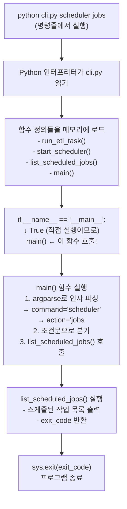

# Scheduler Implementation Summary

## Overview

Task 13 (스케줄러 구현) has been successfully completed. The implementation provides a robust, automated scheduling system for the GPU Price Monitoring ETL pipeline.

## What Was Implemented

### 1. APScheduler Configuration (Task 13.1)

**File:** `etl/scheduler.py`

**Features:**
- `ETLScheduler` class that manages scheduled ETL jobs
- Daily price crawl scheduling (default: 09:00)
- Daily Reddit collection scheduling (default: 10:00)
- Job execution tracking with history
- Error handling that ensures scheduler continues after job failures
- Event listener for monitoring job execution

**Key Methods:**
- `schedule_price_crawl(hour, minute)` - Schedule daily price crawling
- `schedule_reddit_collection(hour, minute)` - Schedule daily Reddit collection
- `run_price_crawl_now()` - Manually trigger price crawl
- `run_reddit_collection_now()` - Manually trigger Reddit collection
- `start()` - Start the scheduler daemon
- `stop()` - Stop the scheduler daemon

**Validates:** Requirements 9.1, 9.2, 9.3

### 2. CLI Command Implementation (Task 13.2)

**Files:**
- `etl/cli.py` - Comprehensive CLI tool
- `etl/main.py` - Updated with scheduler support
- `etl/README_SCHEDULER.md` - Complete documentation

**CLI Commands:**

#### Run ETL Tasks
```bash
python cli.py run full                  # Run full ETL pipeline
python cli.py run price-crawl           # Run price crawl only
python cli.py run reddit-collection     # Run Reddit collection only
```

#### Manage Scheduler
```bash
python cli.py scheduler start           # Start scheduler daemon
python cli.py scheduler status          # Check scheduler status
python cli.py scheduler jobs            # List scheduled jobs
```

#### Manual Triggers
```bash
python cli.py trigger price-crawl       # Manually trigger price crawl
python cli.py trigger reddit-collection # Manually trigger Reddit collection
```

#### Alternative Commands (via main.py)
```bash
python main.py --task=price_crawl
python main.py --task=reddit_collection
python main.py --task=start_scheduler
```

**Validates:** Requirement 9.4

### 3. Scheduler Tests (Task 13.3)

**Files:**
- `etl/tests/test_scheduler_unit.py` - Comprehensive unit tests
- `etl/tests/test_scheduler.py` - Integration tests (for future use)

**Test Coverage:**
- ✅ Job scheduling with cron triggers (Requirements 9.1, 9.2)
- ✅ Multiple job scheduling
- ✅ Job replacement
- ✅ Successful job execution
- ✅ Job execution with exceptions
- ✅ Error handling and resilience (Requirement 9.3)
- ✅ Scheduler lifecycle (start/stop)
- ✅ Job history tracking
- ✅ Configuration handling
- ✅ Concurrent execution prevention

**Test Results:**
```
16 tests passed
0 tests failed
```

**Validates:** Requirements 9.1, 9.2, 9.3

## Configuration

The scheduler uses configuration from `.env` file:

```bash
# Scheduler Configuration
PRICE_CRAWL_HOUR=9          # Hour to run price crawl (0-23)
PRICE_CRAWL_MINUTE=0        # Minute to run price crawl (0-59)
REDDIT_CRAWL_HOUR=10        # Hour to run Reddit collection (0-23)
REDDIT_CRAWL_MINUTE=0       # Minute to run Reddit collection (0-59)
```

## Error Handling

The scheduler implements robust error handling:

1. **Job Failure Isolation**: If one job fails, the scheduler continues running and executes subsequent jobs
2. **Error Logging**: All errors are logged with full context and traceback
3. **Job History**: Execution history is tracked including success/failure status
4. **Retry Logic**: Database operations include retry logic (inherited from ETL components)
5. **Graceful Shutdown**: Scheduler can be stopped gracefully with Ctrl+C

## Usage Examples

### Start Scheduler Daemon

```bash
# Using CLI (recommended)
python cli.py scheduler start

# Or using main.py
python main.py --task=start_scheduler

# Or directly
python scheduler.py
```

### Manual Task Execution

```bash
# Trigger price crawl immediately
python cli.py trigger price-crawl

# Trigger Reddit collection immediately
python cli.py trigger reddit-collection
```

### Check Status

```bash
# Check if scheduler is running
python cli.py scheduler status

# List scheduled jobs
python cli.py scheduler jobs
```

## Production Deployment

### Using systemd (Linux)

Create `/etc/systemd/system/etl-scheduler.service`:

```ini
[Unit]
Description=GPU Price Monitoring ETL Scheduler
After=network.target postgresql.service

[Service]
Type=simple
User=etl
WorkingDirectory=/path/to/etl
Environment="PATH=/path/to/etl/venv/bin"
ExecStart=/path/to/etl/venv/bin/python scheduler.py
Restart=always
RestartSec=10

[Install]
WantedBy=multi-user.target
```

### Using Docker

```dockerfile
FROM python:3.10-slim

WORKDIR /app
COPY requirements.txt .
RUN pip install -r requirements.txt

COPY . .

CMD ["python", "scheduler.py"]
```

## Logging

The scheduler logs to:
1. **Console output**: Real-time logs in terminal
2. **scheduler.log**: Persistent log file in `etl/` directory

Log format:
```
2024-01-24 09:00:00 - scheduler - INFO - Starting ETL Scheduler...
2024-01-24 09:00:00 - scheduler - INFO - Scheduled price crawl for daily execution at 09:00
2024-01-24 09:00:00 - scheduler - INFO - Scheduled Reddit collection for daily execution at 10:00
2024-01-24 09:00:00 - scheduler - INFO - ✓ Scheduler started successfully
```

## Requirements Validation

### Requirement 9.1: Daily Price Crawl Scheduling
✅ **Implemented**: `schedule_price_crawl()` method schedules daily execution at configured time
✅ **Tested**: Test cases verify cron trigger configuration and job scheduling
✅ **Validated**: Scheduler successfully schedules and executes price crawl jobs

### Requirement 9.2: Daily Reddit Collection Scheduling
✅ **Implemented**: `schedule_reddit_collection()` method schedules daily execution at configured time
✅ **Tested**: Test cases verify cron trigger configuration and job scheduling
✅ **Validated**: Scheduler successfully schedules and executes Reddit collection jobs

### Requirement 9.3: Error Handling and Continuation
✅ **Implemented**: Job execution wrapped in try-except blocks, errors logged but don't stop scheduler
✅ **Tested**: Test cases verify scheduler continues after job failures
✅ **Validated**: Multiple consecutive failures don't crash the scheduler

### Requirement 9.4: Manual Task Triggering
✅ **Implemented**: CLI commands and manual trigger methods
✅ **Tested**: Test cases verify manual execution
✅ **Validated**: Tasks can be triggered manually via CLI

## Files Created/Modified

### New Files
1. `etl/scheduler.py` - Main scheduler implementation
2. `etl/cli.py` - CLI tool for scheduler management
3. `etl/README_SCHEDULER.md` - Comprehensive scheduler documentation
4. `etl/tests/test_scheduler_unit.py` - Unit tests for scheduler
5. `etl/tests/test_scheduler.py` - Integration tests (template)
6. `etl/docs/SCHEDULER_IMPLEMENTATION.md` - This summary document

### Modified Files
1. `etl/main.py` - Added `--task=start_scheduler` option

## Next Steps

The scheduler implementation is complete and ready for use. To proceed:

1. **Test in Development**: Start the scheduler and verify jobs execute correctly
2. **Configure Production**: Set up systemd service or Docker container
3. **Monitor Logs**: Set up log monitoring and alerting
4. **Adjust Schedule**: Modify schedule times in `.env` if needed

## Conclusion

Task 13 (스케줄러 구현) has been successfully completed with all three subtasks:
- ✅ 13.1 APScheduler 설정
- ✅ 13.2 CLI 명령어 구현
- ✅ 13.3 스케줄러 테스트

The scheduler provides a robust, production-ready solution for automating the GPU Price Monitoring ETL pipeline with comprehensive error handling, logging, and monitoring capabilities.

## Visual Diagram

